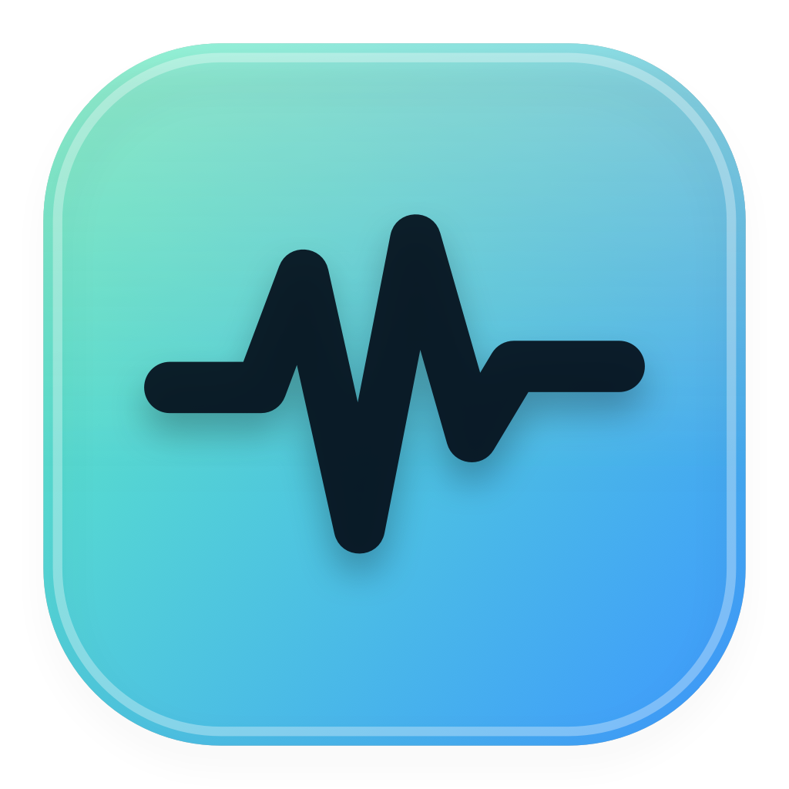
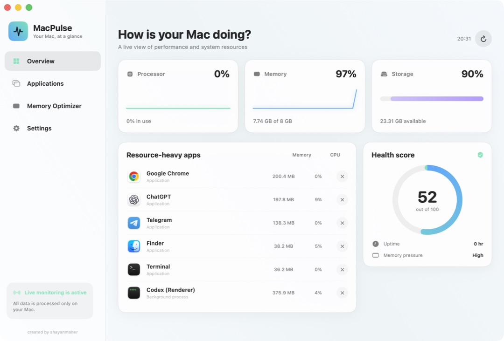
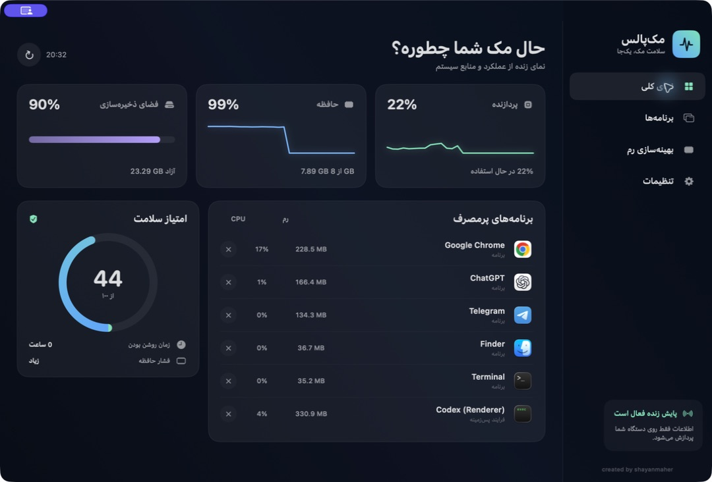

  

<h1 align="center">MacPulse · مک‌پالس</h1>

  A lightweight, native macOS system monitor — right from your menu bar. 
  یک پایشگر سبک و بومی برای macOS، همیشه در نوار منو.

  <a href="https://github.com/shayanmaher/MacPulse/releases/latest"><strong>Download latest release · دانلود آخرین نسخه</strong></a>

  
  
  
  

> **Binary-only distribution:** this repository contains the downloadable application, documentation, and screenshots. Source code is not published.

## Preview · پیش‌نمایش

| English · Light | فارسی · تیره |
|---|---|
|  |  |

---

## English

MacPulse gives you a clear, live view of your Mac's CPU, memory, storage, health score, and resource-heavy applications. Its compact menu bar panel remains available after the main dashboard is closed.

### Features

- Live CPU, memory, and storage monitoring
- Compact menu bar panel with live CPU percentage
- Resource-heavy application and process list
- Safe Quit and Force Quit controls with confirmation
- Multi-application memory optimizer
- English and Persian interface with instant switching
- Light, Dark, and System appearance modes
- `Command-Q` closes the dashboard but keeps monitoring active
- Explicit **Quit Completely** button and `Option-Command-Q` shortcut
- Private by design: all information is processed locally
- Universal app for Apple Silicon and Intel Macs

### Requirements

- macOS 14 Sonoma or later
- Apple Silicon or Intel Mac

### Installation

1. Download `MacPulse-1.2.1.dmg` from the [latest release](https://github.com/shayanmaher/MacPulse/releases/latest).
2. Open the DMG and drag **MacPulse** into **Applications**.
3. Launch MacPulse from Applications or Launchpad.

This build is locally signed but not yet Apple-notarized. On first launch, macOS may ask for confirmation. Use Finder's standard **right-click → Open** flow and confirm **Open**. You do not need to disable Gatekeeper or enable “Anywhere.”

### Controls

- `Command-Q`: close the dashboard and keep MacPulse in the menu bar
- `Option-Command-Q`: quit MacPulse completely
- Menu bar → **Quit**: quit MacPulse completely

### Privacy

MacPulse does not upload system information, application names, or usage statistics. Monitoring happens entirely on your Mac.

---

## فارسی

مک‌پالس نمایی شفاف و زنده از پردازنده، حافظه، فضای ذخیره‌سازی، امتیاز سلامت و برنامه‌های پرمصرف مک ارائه می‌دهد. پنل کوچک نوار منو حتی پس از بستن داشبورد اصلی در دسترس باقی می‌ماند.

### امکانات

- نمایش زندهٔ مصرف پردازنده، حافظه و فضای ذخیره‌سازی
- پنل کوچک در نوار منو همراه درصد زندهٔ CPU
- فهرست برنامه‌ها و فرایندهای پرمصرف
- بستن امن و خروج اجباری همراه تأیید
- انتخاب هم‌زمان چند برنامه برای آزادسازی حافظه
- رابط فارسی و انگلیسی با تغییر لحظه‌ای
- تم روشن، تیره و هماهنگ با سیستم
- `Command-Q` فقط داشبورد را می‌بندد و پایش را فعال نگه می‌دارد
- دکمهٔ واضح «خروج کامل» و میان‌بر `Option-Command-Q`
- پردازش کاملاً محلی و بدون ارسال اطلاعات
- نسخهٔ Universal برای مک‌های Apple Silicon و Intel

### پیش‌نیاز

- macOS 14 Sonoma یا جدیدتر
- مک Apple Silicon یا Intel

### نصب

1. فایل `MacPulse-1.2.1.dmg` را از [آخرین نسخه](https://github.com/shayanmaher/MacPulse/releases/latest) دانلود کنید.
2. فایل DMG را باز کرده و **MacPulse** را داخل **Applications** بکشید.
3. مک‌پالس را از Applications یا Launchpad اجرا کنید.

این نسخه امضای محلی دارد اما هنوز توسط اپل Notarize نشده است. ممکن است macOS در اولین اجرا تأیید بخواهد. در Finder روی اپ راست‌کلیک کرده، **Open** را بزنید و دوباره **Open** را تأیید کنید. نیازی به خاموش‌کردن Gatekeeper یا فعال‌کردن گزینهٔ ناامن Anywhere نیست.

### کنترل‌ها

- `Command-Q`: بستن داشبورد و ادامهٔ فعالیت در نوار منو
- `Option-Command-Q`: خروج کامل از مک‌پالس
- نوار منو ← «خروج کامل»: خروج کامل از برنامه

### حریم خصوصی

مک‌پالس اطلاعات سیستم، نام برنامه‌ها یا آمار مصرف را آپلود نمی‌کند. تمام پایش‌ها فقط روی دستگاه شما انجام می‌شوند.

---

  created by <strong>shayanmaher</strong>

